# HWbench origins

Hwbench the benchmark orchestrator was  initially written by the Criteo Hardware Team.

# Specifications

- Predictive
- Modular
- Automated
- Hardware driven

---

We have not integrated the device in prod yet
Siena is installed on a devbox that is not representative to a final server. Fan speeds and other chassis specific metrics will be ignored to focus on the processor itself.

Micro benchmarks are used as a reference point for app performance with our internal customers.

Time-limited evaluation

# Scripted

- __runtime__ : absolute time in seconds per executed benchmark

- __monitor__ : enable system monitoring via BMC \(redfish\)\, system \(turbostat\, sysfs\, …\)

    - __Objects__:
        - _Thermal_
        - _Fan_
        - _PowerConsumption_
        - _PowerSupplies_
        - _Frequencies_

    - __Supports__: Generic redfish \+ OEM \(HPE / DELL\)

- __engine__ : micro\-benchmark\, hwbench plugin to wrap features & command lines

- __hcc__ : selects cores from the system to be eligible for benchmarking\.

    - __Objects__:
      - Logical cores \( _\<int>_ \)
      - Physical cores \( _CORE\<int>\)_
      - NUMA \( _NUMA\<int>_ \)
      - Quadrant\( _QUADRANT\<int>_ \)
      - _Simple_  \(1\, 2\, 4\, 8\, 16\, 32\.\.\.\)

    Usage: interval \(0\-63\)\, list \(1\,31\)

    Example: CORE0\, CORE1\, QUADRANT0\, QUADRANT0\-3

- __hccs__ : selects how hosting cpu cores are associated with jobs

    - __Objects__:
      - _none _ \(all cores at once\)\
      - _iterate _ \(each hcc value will create a new job\)

- __stressor\_range__ : selects how many engine instance per job

    - __Objects__:
      - \<int>\
      - interval \(\<x\-y>\)
      - list \(\<x>\,\<y>\)\
      - _auto _ \(same value as hccs\)

- __\[<__  _job\_name_  _>_  __\]__ : defines one top level job

- __engine\_module__ : what module from selected  _engine_

- __engine\_module\_parameter__ : a list of  _engine\_module_  tests to execute

# Execution (example with AMD 8434P)

Using this config:

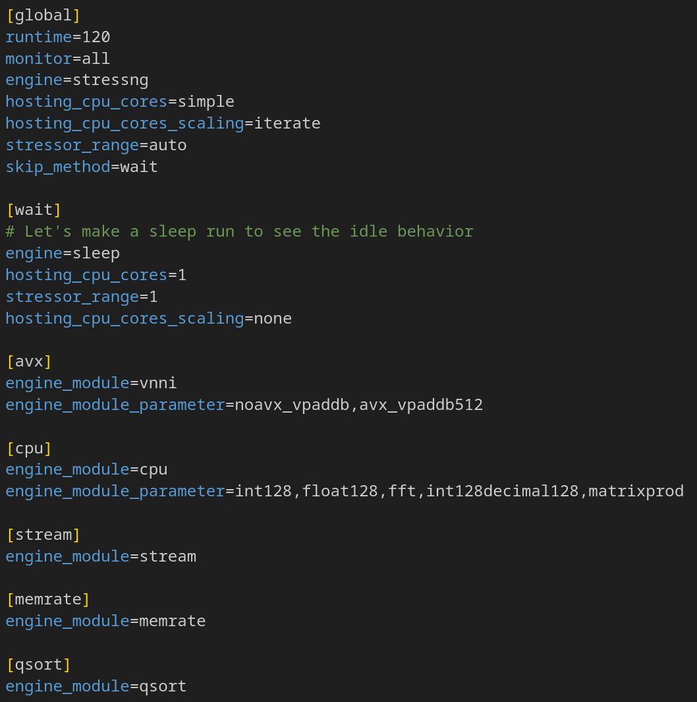

Output:

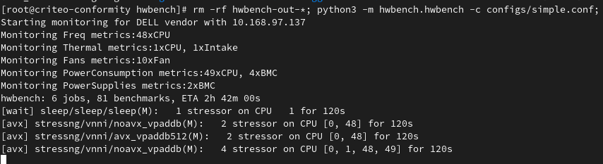

collected info:
* System info
* Performance
* Monitoring

# Render (example with AMD 8434P)

Compare & graph several traces file

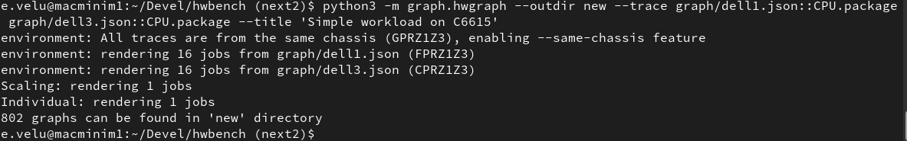

__The following graphs are:__

a  _very small_  subset of the complete graph serie​s

fully automatically generated

# Same chassis graph

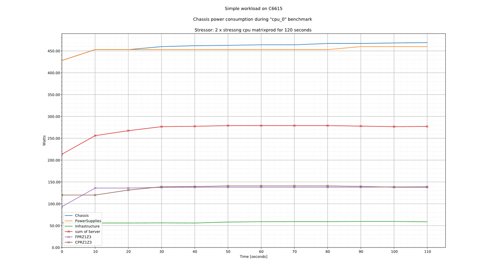

# Individual Fan behavior

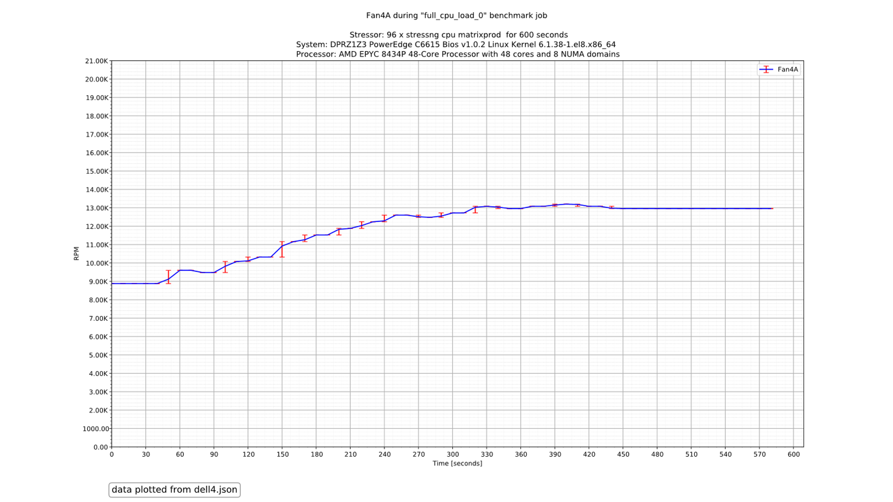

# All fans vs power

# All fans vs thermal

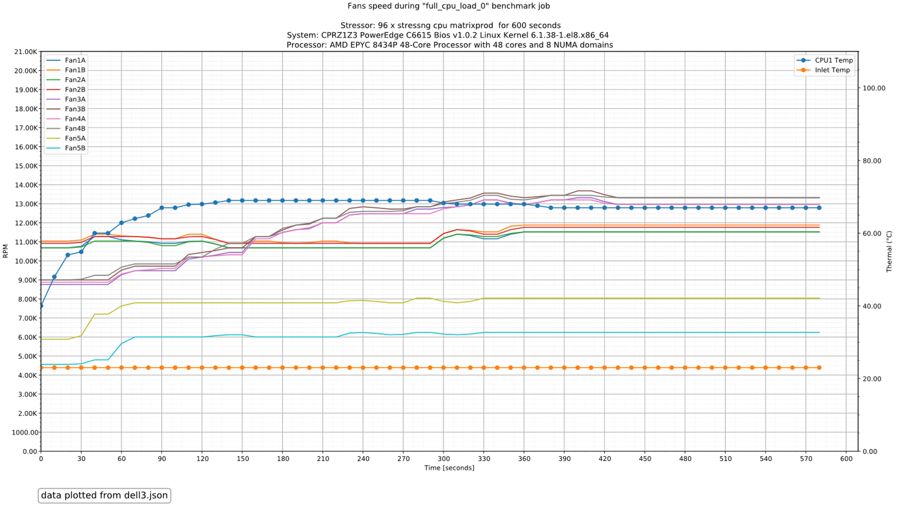

# Compared max perf

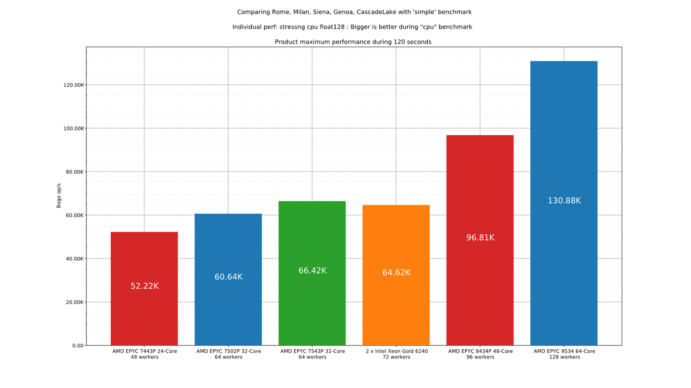

# Compared max perf per core

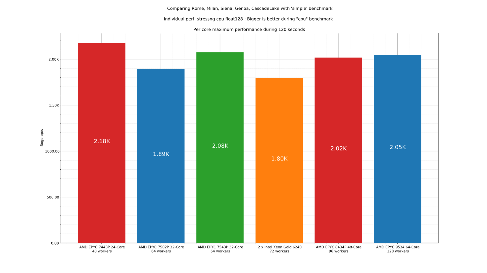

# Compared max perf per watt

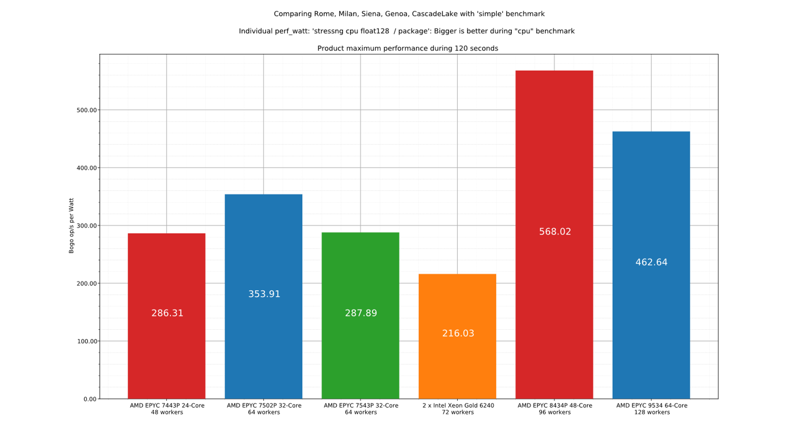

# Compared max perf per core per watt

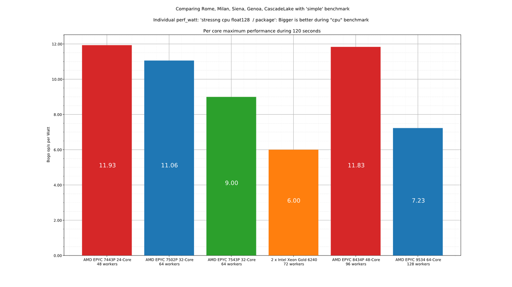

# Compared scaling performance

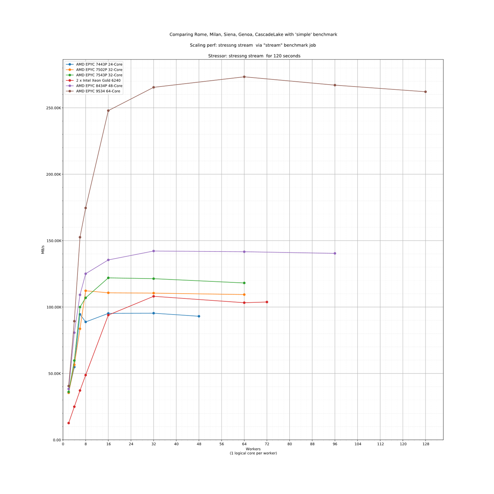

# Compared scaling performance per watt

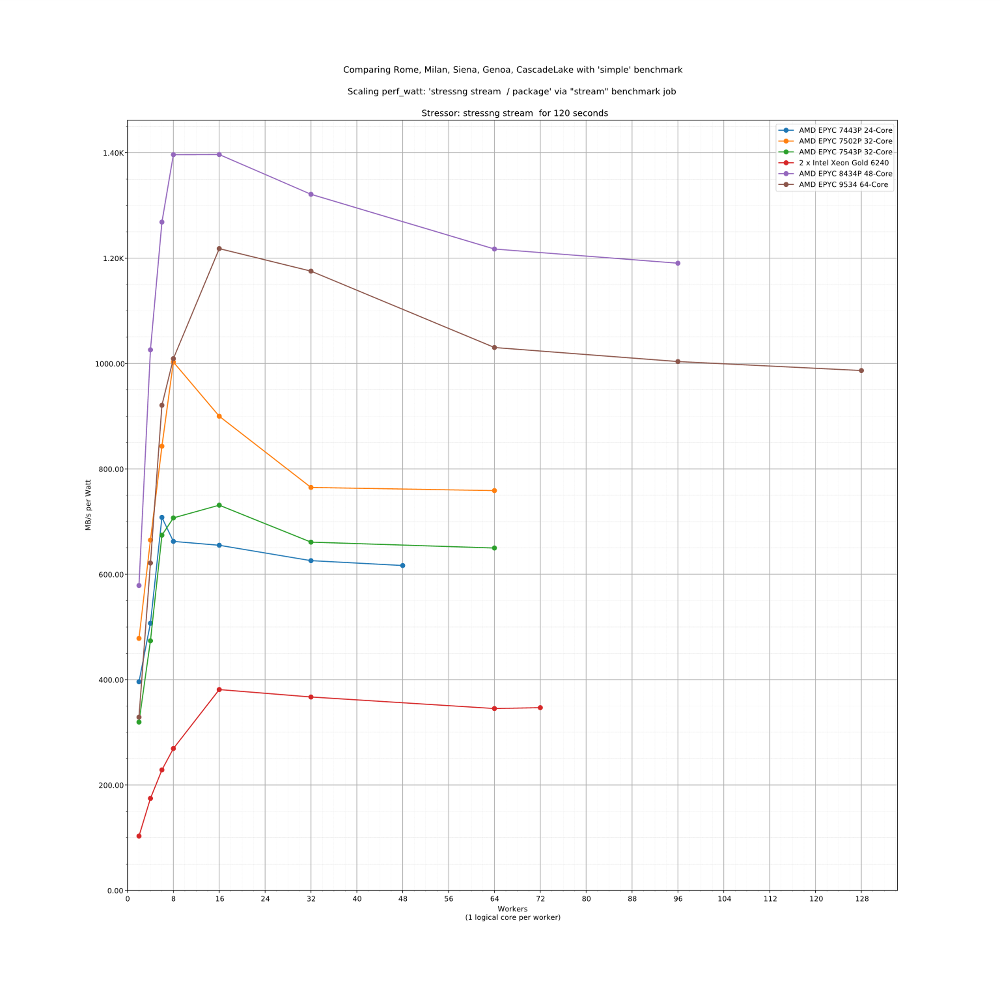

# Custom spike engine to study fans

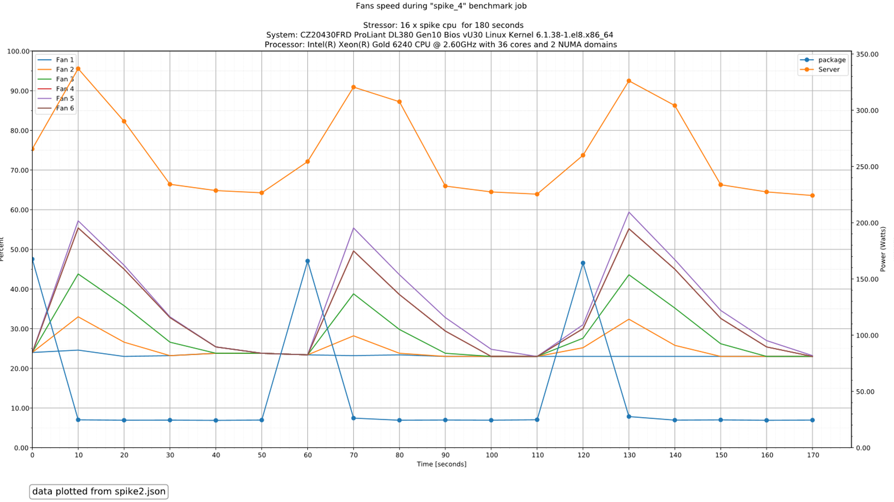

# What's next ?

__In random order:__

- Add more metrics: PDU & other power sensors\, thermal sensors
- Add more engines: storage\, applicative sample loads
- Add parallelism to combine several engines: i\.e\.:  _stress\-ng_  \+  _fio_
- Add more graph types?
- Get contributions\, ideas?
